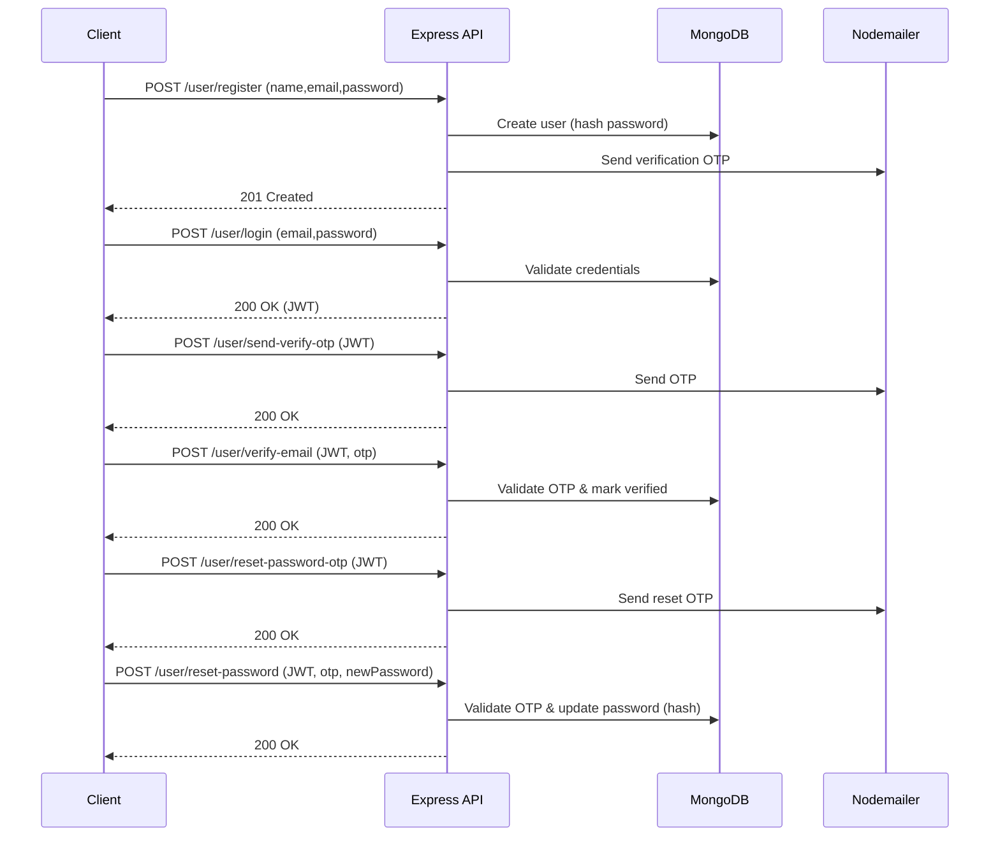

# 🔐 MERN Authentication Backend

A production-ready backend for a MERN authentication system with **JWT auth**, **email verification**, and **password reset via email OTP**.

> Last updated: 2025-09-26

---

## ✨ Features

- User **registration & login** (JWT-based)
- **Email verification** via OTP
- **Password reset** via email OTP
- Secure password hashing (bcrypt)
- Protected routes with **JWT middleware**
- Environment-driven configuration
- Ready-to-import **Postman collection**

---

## 🏗️ Architecture

```
server/
├── config/
│   ├── mongodb.js            # MongoDB connection
│   └── nodemailer.js         # Nodemailer transport
│
├── controllers/
│   └── authController.js     # Register, login, verify, reset password
│
├── middleware/
│   └── userAuth.js           # JWT auth guard
│
├── models/
│   └── userModel.js          # User schema (OTP fields included)
│
├── routes/
│   └── authRoutes.js         # /user/* routes
│
├── server.js                 # App entry, mounts /user routes
├── package.json
└── .env                      # Environment variables
```

### Data Model (User)
- `name: String` (required)
- `email: String` (unique, required)
- `password: String` (hashed, required)
- `isVerified: Boolean`
- `verifyOtp: String`, `verifyOtpExpiry: Number`
- `resetOtp: String`, `resetOtpExpiry: Number`

---

## 🔄 High-Level Flow



---

## 🧰 Tech Stack

- **Node.js**, **Express.js**
- **MongoDB**, **Mongoose**
- **JWT** for auth, **bcrypt** for hashing
- **Nodemailer** for emails
- **dotenv**, **cors**, **cookie-parser**

---

## 🚀 Getting Started

### 1) Clone & Install
```bash
git clone https://github.com/<your-username>/<your-repo>.git
cd <your-repo>/server
npm install
```

### 2) Environment Variables
Create `server/.env`:
```env
PORT=5000
MONGO_URI=YOUR_MONGODB_URI
JWT_SECRET=YOUR_SUPER_SECRET
SENDER=your_email@example.com
EMAIL_PASS=your_email_app_password
```
> **Note:** For Gmail, use an **App Password** (not your login password).

### 3) Run
```bash
npm start
# Server: http://localhost:5000
```

---

## 📡 API Endpoints

Base URL: `http://localhost:5000`

### Auth
| Method | Path                       | Auth | Description |
|-------:|----------------------------|:----:|-------------|
| POST   | `/user/register`           |  -   | Register user & send verify OTP |
| POST   | `/user/login`              |  -   | Login, receive JWT |
| POST   | `/user/logout`             | JWT  | Logout (if implemented) |

### Email Verification
| Method | Path                       | Auth | Body |
|-------:|----------------------------|:----:|------|
| POST   | `/user/send-verify-otp`    | JWT  | — |
| POST   | `/user/verify-email`       | JWT  | `{ "otp": "123456" }` |

### Password Reset (via OTP)
| Method | Path                       | Auth | Body |
|-------:|----------------------------|:----:|------|
| POST   | `/user/reset-password-otp` | JWT  | — |
| POST   | `/user/reset-password`     | JWT  | `{ "otp": "123456", "newPassword": "NewStrongPassw0rd!" }` |

> **Why JWT for reset?** This implementation requires the user to be authenticated to request the reset OTP. If you prefer a _public_ reset (email only), move these routes out of `userAuth` middleware.

---

## 🔒 Security Best Practices

- Store **JWT_SECRET** securely and rotate periodically
- Use **strong password policy** on the client
- Hash passwords with **bcrypt**
- Limit OTP validity (e.g., **5 minutes**) and attempts
- Add **rate limiting** to OTP endpoints
- Use **HTTPS** in production
- Never commit `.env` or secrets

---

## 🧪 Postman Collection

Import the collection into Postman:

- **Collection:** [`MERN_Auth_Backend.postman_collection.json`](sandbox:/mnt/data/MERN_Auth_Backend.postman_collection.json)

### Quick Start
1. Import the collection.
2. Set `{baseUrl}` to your server URL (default: `http://localhost:5000`).
3. Register → Login → copy token to collection variable `authToken`.
4. Call protected routes (send/verify OTP, reset password).

---


## 📁 Project Scripts

Check `server/package.json` for scripts like:
- `start` – start server
- `dev` – (if present) nodemon dev mode

---

---

## 🙋 Support
Found a bug or have a feature request? Open an **issue** or a **PR**. Happy building!
